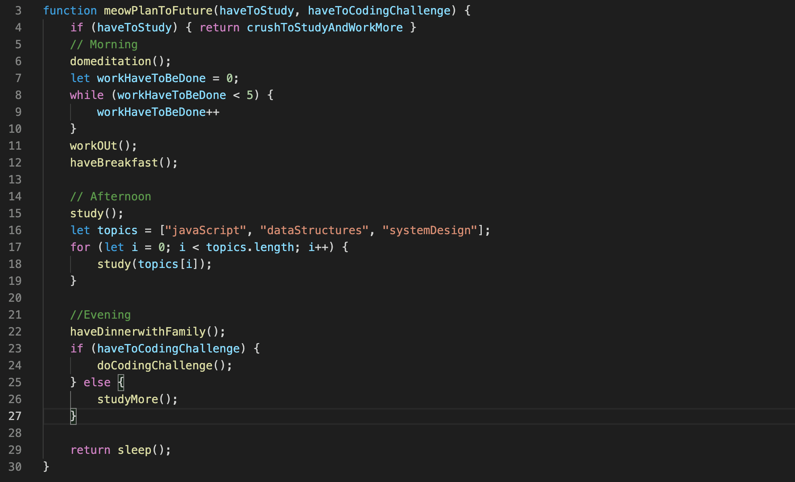

<!-- ### Hi there 👋 -->

<!--
**Meowmerry/meowmerry** is a ✨ _special_ ✨ repository because its `README.md` (this file) appears on your GitHub profile.

Here are some ideas to get you started:

- 🔭 I’m currently working on ...
- 🌱 I’m currently learning ...
- 👯 I’m looking to collaborate on ...
- 🤔 I’m looking for help with ...
- 💬 Ask me about ...
- 📫 How to reach me: ...
- 😄 Pronouns: ...
- ⚡ Fun fact: ...
-->

# ~  👋 Hello and Welcome — I'm So Glad You're Here!   😄 ~

 
 

Hi! I'm Thasanee — but you can call me Meow.
I'm a Software Developer who’s passionate about crafting meaningful, intuitive user experiences.

I specialize in front-end development and love transforming design concepts into functional, responsive, and accessible interfaces. I bring strong problem-solving skills, attention to detail, and a collaborative spirit to every team I join.

🌱 A little about me:
🛠️ Currently working as a software engineer

🌍 Multilingual: Thai, Lao, English, and a little Spanish

📚 Always learning and up for a challenge

💻 Most used tech: `JavaScript`, `TypeScript`, `React` and `Other...`

<!--  -->
<!-- #### ~   👯🌱 👯🌱  👯🌱  👯🌱   👯🌱  👯🌱    👯🌱  👯🌱  👯🌱  👯🌱  👯🌱  👯🌱  ~  -->

# 🧠 Technical Skills

## 🧰 Tools & Technologies

<!--  -->

## &#x270d; Blog & Social

📫 Connect With Me

 
## :chart_with_upwards_trend: GitHub Stats

## Preferences

<!-- Images -->
[cover]: https://raw.githubusercontent.com/buildingwatsize/buildingwatsize/main/assets/cover.png

Resources
GitHub Readme Stats: https://github.com/anuraghazra/github-readme-stats
Emojis: https://github.com/ikatyang/emoji-cheat-sheet/blob/master/README.md
Icons: https://simpleicons.org/
Shields: https://shields.io/
Header Generator: https://reheader.glitch.me/
Visitor Badge: https://github.com/jwenjian/visitor-badge
Articles: https://betterprogramming.pub/add-your-recent-published-mediums-article-on-github-readme-9ffaf3ad1606

